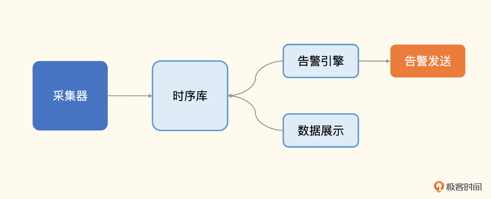
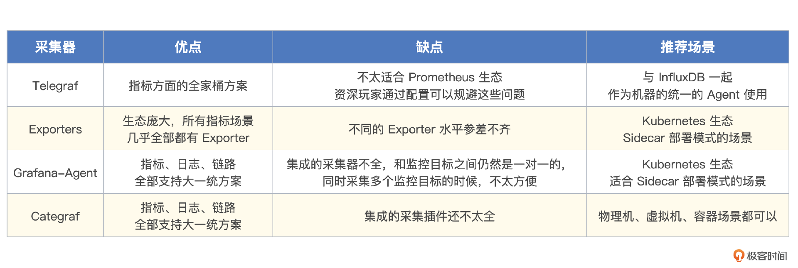
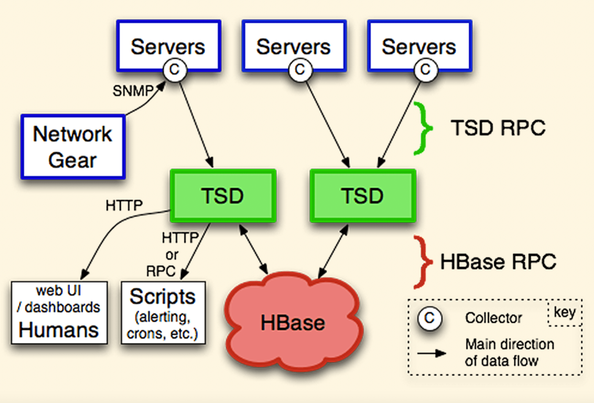
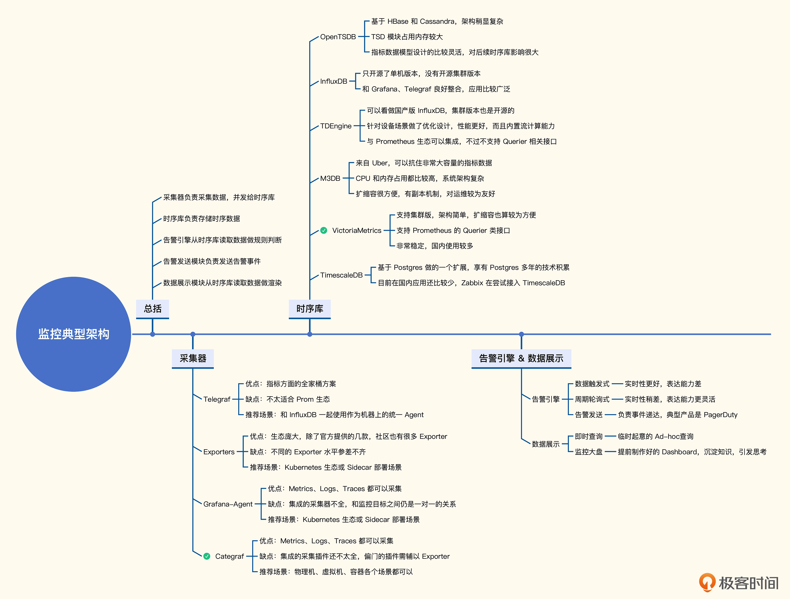

# 03｜架构概述：一个监控系统的典型架构是什么样的？
## 监控系统的典型架构图

## 采集器
* [Telegraf](https://github.com/influxdata/telegraf)
* [Exporters](https://github.com/prometheus/node_exporter)
* [Grafana-Agent](https://github.com/grafana/agent)
* [Categraf](https://github.com/flashcatcloud/categraf)

## 时序库
* OpenTSDB
  

* InfluxDB
* TDEngine
* M3DB
* VictoriaMetrics
* TimescaleDB

## 告警引擎
### 架构
* 数据触发式
* 周期轮询式

## 数据展示

## 小结
* 采集器：用于收集监控数据，业界有不少开源解决方案，大同小异，总体分为推拉两种模式，各有应用场景。Telegraf、Exporters 用得最广泛，Grafana-Agent 和 Categraf 是后来者，当然还有 Datadog-Agent 这种商业解决方案，我的建议是优先考虑 Categraf，相对而言，它使用起来更加便捷。如果有些场景 Categraf 没有覆盖，可以考虑辅以一些特定的 Exporter。
* 时序库：用于存储时序数据，是一个非常内卷的行业，有很多开源方案可供选择。如果规模比较小，1000 台机器以下，通常一个单机版本的 Prometheus 就够用了。如果规模再大一些，建议你考虑 VictoriaMetrics，毕竟架构简单，简单的东西可能不完备，但是出了问题容易排查，更加可控。
* 告警引擎：用于做告警规则判断，生成告警事件。这是监控系统的一个重要组成部分，通常是基于固定阈值规则来告警。当然，随着时代的发展，也有系统支持统计算法和机器学习的方式做告警预判，我觉得是可以尝试的。AiOps 概念中最容易落地，或者说落地之后最容易有效果的，就是告警引擎。不过 Google SRE 的观点是不希望在告警中使用太多 magic 的手段，这个就见仁见智了。
* 数据展示：用于渲染展示监控数据。最常见的图表就是折线图，可以清晰明了地看到数据变化趋势，有些人会把监控大盘配置得特别花哨，各种能用的图表类型都用一下，这一点我不敢苟同，我还是觉得实用性才是最核心的诉求。很多监控系统会内置看图功能，开源领域最成熟的就是 Grafana，如果某个存储无法和 Grafana 对接，其流行性都会大打折扣。

