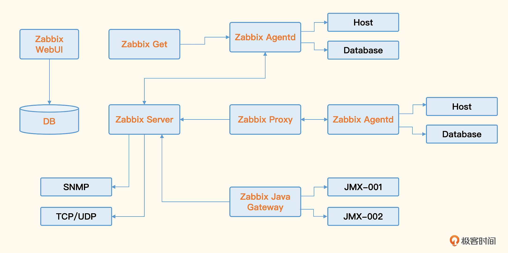
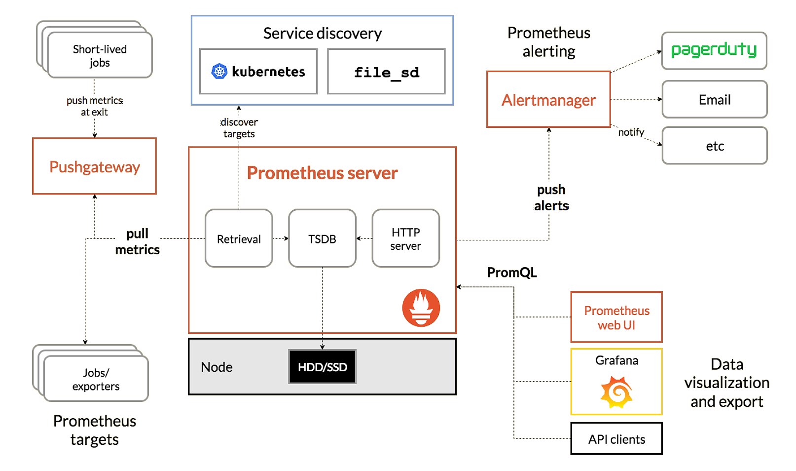

# 01｜背景信息：监控需求以及开源方案的横评对比
## 可观测性三大支柱
* 指标监控
* 日志监控
* 链路追踪
## 工具
### Zabbix

### Open-Falcon

### Prometheus

### Nightingale

## 小结

# 02｜基本概念：监控圈子有哪些行业黑话？
## Prometheus支持数据类型
* Gauge
* Counter
* Histogram
* Summary
## 小结
* 监控：这个词在不同的上下文会有不同的语义，有的时候表示数据采集和可视化，有的时候表示整个监控系统。不过不管怎么理解，通常都不影响交流。
* 监控指标：这个概念很关键，不同的监控产品有不同的描述方式，不过随着 OpenMetrics 标准的建立，指标描述方式会渐渐趋于一致。重点要了解 Prometheus 的指标描述方式 metric + labels，当然 metric 也可以看作一个特殊的 label。Influx 格式也很重要，建议你掌握，如果使用 Telegraf 作为采集器，就绕不过去这个格式。
* 指标类型：针对时下流行的 Prometheus，我们讲解了 4 种指标类型及每个类型的适用场景，最后明确了指标类型最核心的作用：在采集侧埋点时，SDK 会根据数据类型做不同的计算逻辑。
* 时序库：存储时序序列数据的数据库，它已经成为了一个单独的数据库细分方向，而且随着 IoT 的场景越来越多，以及微服务的发展，时序库这个话题也越来越流行。
* 告警收敛和告警闭环：告警事件层面的话题是所有监控系统都需要处理的。当然也可以作为一个专门的产品和多种监控系统对接，专注处理告警事件，希望国内能有超越 Bigpanda、Pagerduty 的产品出现。

